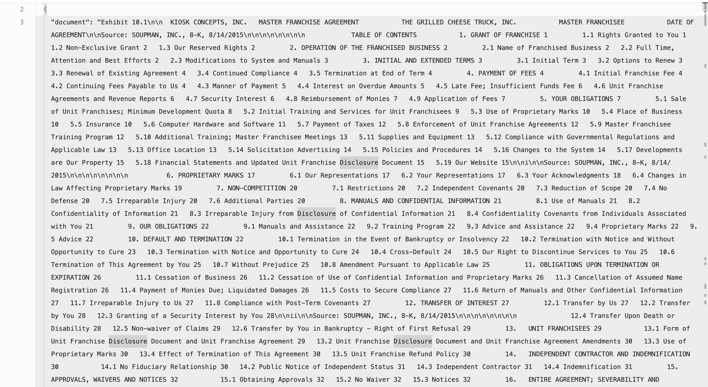
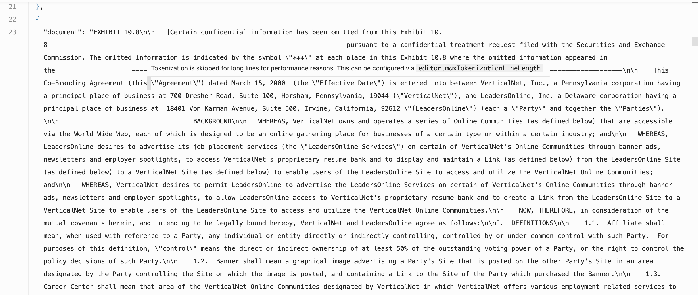

# Failure Analysis for MOAR

## Overview of the workload

I use the *CUAD Legal Analysis* dataset. The dataset contains 510 legal contracts (each averaging 7,727 words) annotated with 41 clause categories. The task is to extract text spans for each clause type present in a contract. The initial pipeline consists of a single map that prompts for all clause types at once and outputs a list of `{clause_type, text_span}` objects. Though in the paper, the authors state that **MOAR** gives the best result at up to **0.762** accuracy, I found that the search process can even crash at an early step and output worse pipeline.

### Run Command

```bash
# move to the directory
cd break_moar

# Run the experiment
bash run_fail.sh
```

## Breakpoint

After searching for only **2** iterations, the searching process crashes:

```
Agent failed with error: No applicable action found for expansion. Action space may be exhausted or all actions are inapplicable.                                                                            
           Node 0 is fully explored, selecting best child                                                                                                                                                               
           Child outputs/cuad_moar/cuad_gpt-4o-mini.yaml: visits = 10255, value = 0.24392347364621483                                                                                                                   
           [Thread 6222262272] SELECTED NODE: 6                                                                                                                                                                         
           [Thread 6222262272] EXPANSION
```

And the output plan added a **<u>HeadTail Compression</u>** operator before the extraction, which leads to:

* avg change in cost: **$-0.07**
* avg change in accuracy: **-0.2510 (F1 Score)**

```yaml
- name: keep_contract_preamble_and_signature_150_80
  type: code_map
  code: "def transform(input_doc):\n    document_content = input_doc.get('document',\
    \ '')\n    words = document_content.split()\n\n    if len(words) <= 230:\n   \
    \     # Document is short enough, keep as is\n        truncated = document_content\n\
    \    else:\n        head = ' '.join(words[:150])\n        if 80 > 0:\n       \
    \     tail = ' '.join(words[-80:])\n            truncated = head + ' ... ' + tail\n\
    \        else:\n            truncated = head\n\n    return {'document': truncated}"
```

## Analysis

The `Head/Tail Compr.` operator is based on an assumption:

> "Table 2: Useful when key information typically appears at document boundaries (e.g., abstract, conclusion)". 

The assumption works for some cases, but is not a good fit for this workload as we need to extract all the clauses showing in the document, which can show up anywhere among the document. If we take a look at the dataset, we can find that the "head" part can even be an index/Table-of-Contents, directly breaking the assumption of `Head/Tail Compr.` Thus, the code synthesis rewrite process should not only use "evaluation functions" after it gives a rewrite solution, but should consider combining the workload objectives and evaluation functions with the rewrite planning process (i.e., we need a better query planner built upon the **MOAR** optimizer).

Take the **Head/Tail Compression** code-synthesis-based rewrite directive for example, it exhibits critical limitations: 

1. **Boundary-Dependent Assumption**: It assumes key information *always* resides at document edges (e.g., abstracts/conclusions), failing when critical content appears mid-document (e.g., technical specifications in body text or narrative turning points). 
2. **Rigid Parameterization**: Fixed head/tail lengths `h/t` lack adaptability—small `h/t` causes severe information loss, while large `h/t` undermines compression efficacy, especially for structurally diverse documents. 
3. **Contextual Fragmentation**: Discarding mid-document content severs contextual coherence, impairing semantic understanding for tasks requiring holistic analysis (e.g., multi-step reasoning or narrative comprehension). 

These constraints make it viable *only* for highly structured documents with predictable boundary-centric information. We also found that code synthesis failed frequently as the "available models" may not optimized for coding capabilities.

**Dataset Samples**




